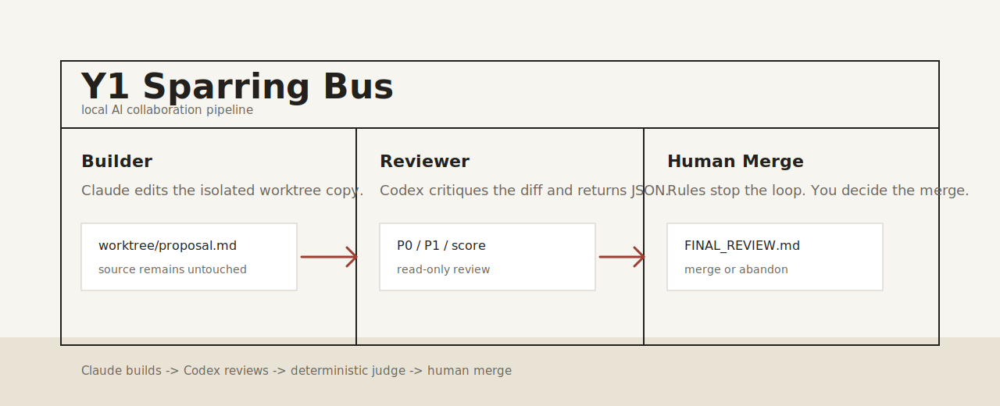

# Y1 Sparring Bus / 本机 AI 左右互搏总线

> **Claude writes. Codex reviews. Rules decide when it is good enough. You decide whether to merge.**  
> **Claude 负责改，Codex 负责审，规则判断是否达标，最终由人决定是否合并。**

Y1 Sparring Bus is a local AI sparring console for proposals, reports, strategy notes, prompts, agent skills, and small code files. It turns the messy "rewrite this / review this again" loop into a visible, repeatable, human-controlled workflow.

Y1 Sparring Bus 是一个本机 AI 左右互搏控制台，适合改方案、汇报稿、策略备忘、提示词、Agent Skill 和小型代码文件。它把“让一个 AI 改、再让另一个 AI 挑刺”的过程，变成可视化、可复盘、可人工把关的流程。



[](LICENSE)
[](#v10--v10)
[](#requirements--系统要求)
[](#quickstart--快速开始)
[](#why-it-matters--为什么重要)

## Can I Use It Right After Download? / 下载后能直接用吗

Yes for the local UI, examples, docs, and backend smoke test. Full automatic sparring needs your Mac to already have Claude Code CLI and Codex CLI installed and logged in.

本机页面、演示案例、文档和后端烟测可以直接跑。完整自动互搏需要你的 Mac 已经安装并登录 Claude Code CLI 和 Codex CLI。

```bash
bash scripts/install.sh
bash scripts/smoke-test.sh
bash scripts/doctor.sh --strict
```

Read [docs/RUN_MODES.md](docs/RUN_MODES.md) for the exact capability levels.

准确能力档位见：[docs/RUN_MODES.md](docs/RUN_MODES.md)。

## What It Does / 它做什么

Most AI editing workflows have one weak point: a single model rewrites confidently, but you still have to guess whether the result is truly better.

很多 AI 改稿流程的问题在于：一个模型改得很自信，但你仍然不知道它到底是变好了，还是只是变顺了。

Y1 Sparring Bus adds a second mind and a stop rule:

Y1 Sparring Bus 增加了第二个模型和明确的停止规则：

```text
your file + one clear goal
  -> Claude Builder rewrites an isolated copy
  -> local Runner checks obvious risks
  -> Codex Reviewer scores and flags P0/P1/P2 issues
  -> deterministic Judge decides continue / stop / escalate
  -> you inspect FINAL_REVIEW + diff, then merge or abandon
```

The result is not only a better draft. You also get an audit trail showing what changed, what risks remain, and why the loop stopped.

最终产物不只是一个更好的稿子。你还会得到完整留痕：改了什么、还有什么风险、为什么系统判断可以停。

## Built For / 适合什么

| Use case | What improves | 使用场景 | 改善效果 |
|---|---|---|---|
| Leadership reports | sharper conclusions, clearer evidence | 领导汇报 | 结论前置、证据更清楚 |
| Business proposals | stronger structure, cleaner value logic | 商务方案 | 结构更稳、价值逻辑更强 |
| Strategy notes | explicit assumptions and risks | 策略备忘 | 假设和风险更明确 |
| Agent skills / prompts | clearer triggers and boundaries | Agent Skill / 提示词 | 触发边界更清楚 |
| Small code files | review before human-controlled merge | 小型代码文件 | 合并前先做只读审查 |

## Demo Cases / 演示案例

Start with the demo cases if you want to understand the product quickly.

如果想最快理解它的作用，先跑演示案例。

| Case | File | Suggested goal |
|---|---|---|
| Chinese proposal polish / 中文方案改稿 | [examples/demo_proposal_zh.md](examples/demo_proposal_zh.md) | `把这份方案改成适合领导评审的版本：结论前置，删掉防御性表达，补清楚投入产出逻辑，不编造数据。` |
| English leadership memo / 英文管理备忘 | [examples/demo_leadership_memo_en.md](examples/demo_leadership_memo_en.md) | `Rewrite this into a crisp leadership memo: decision first, risks explicit, next actions concrete, no filler.` |
| Agent skill tightening / Skill 边界收紧 | [examples/demo_agent_skill.md](examples/demo_agent_skill.md) | `Improve this skill spec: clarify triggers, non-goals, safety boundaries, and failure handling. Keep it practical.` |
| Python review / Python 代码审查 | [examples/demo_python_script.py](examples/demo_python_script.py) | `Review and improve this small script without changing its basic purpose. Fix correctness, clarity, and edge cases.` |

Full demo guide: [docs/DEMO_CASES.md](docs/DEMO_CASES.md)

完整案例说明：[docs/DEMO_CASES.md](docs/DEMO_CASES.md)

## Why It Matters / 为什么重要

Y1 Sparring Bus is designed around one principle: **AI may iterate, but humans keep the final decision.**

Y1 Sparring Bus 的核心原则是：**AI 可以多轮迭代，但最终决策权必须在人手里。**

- Original files are never edited directly.  
  原文件不会被 AI 直接覆盖。
- Every job creates a frozen snapshot and an isolated worktree.  
  每个任务都会冻结原文，并复制一份隔离副本给 AI 修改。
- Every Builder prompt, patch, Runner log, Reviewer JSON, and Judge result is saved.  
  Builder prompt、diff、检查日志、Reviewer JSON、Judge 判断都会留存。
- Merge always requires explicit human confirmation.  
  合并必须人工确认。
- Claude child processes strip `ANTHROPIC_*` environment variables.  
  Claude 子进程会移除 `ANTHROPIC_*` 环境变量。
- Jobs are plain local files; there is no database, daemon, or cloud service.  
  Job 都是本机普通文件，没有数据库、守护服务或云端服务。

## What You Get After A Run / 跑完会得到什么

```text
jobs/<job_id>/
  TASK.md                 # frozen goal and acceptance gates / 固化目标和验收门槛
  STATUS.json             # current state and score trend / 当前状态和评分轨迹
  ledger.jsonl            # append-only event log / 追加式事件日志
  INPUT_SNAPSHOT/<file>   # original frozen copy / 原文快照
  worktree/<file>         # AI-edited copy / AI 修改副本
  rounds/                 # prompts, patches, reviews, judge records / 每轮记录
  FINAL.md                # final candidate / 最终候选稿
  FINAL.diff              # original vs final / 原文与最终稿差异
  FINAL_REVIEW.md         # human decision brief / 给人看的决策简报
```

The most useful file is `FINAL_REVIEW.md`: it tells you what changed, what score it reached, what issues remain, and whether the system recommends merge, another round, or escalation.

最有用的是 `FINAL_REVIEW.md`：它会告诉你改了什么、分数到了哪里、还剩什么问题，以及系统建议合并、继续一轮，还是交给人判断。

## Quickstart / 快速开始

```bash
bash scripts/install.sh
bash scripts/start.sh
```

Open / 打开：

```text
http://127.0.0.1:8765/sparring
```

Choose a workspace root / 指定文件浏览根目录：

```bash
bash scripts/start.sh 8765 ~/Documents
# or / 或
SPARRING_WORKSPACE_ROOT=~/Documents bash scripts/start.sh
```

Check full automatic mode / 检查完整自动模式：

```bash
bash scripts/doctor.sh --strict
```

Stop / 停止：

```bash
bash scripts/stop.sh
```

## Requirements / 系统要求

| Item | Requirement | 项目 | 要求 |
|---|---|---|---|
| OS | macOS | 操作系统 | macOS |
| Python | 3.9+ | Python | 3.9+ |
| Builder | Claude Code CLI, logged in locally | Builder | 本机 Claude Code CLI 已登录 |
| Reviewer | Codex app CLI, logged in locally | Reviewer | 本机 Codex app CLI 已登录 |
| Input | one UTF-8 text file | 输入 | 单个 UTF-8 文本文件 |

Word, PDF, Excel, and binary files should be converted to `.md` or `.txt` first.

Word、PDF、Excel 和二进制文件请先转成 `.md` 或 `.txt`。

## Local Backend / 本机后台

The backend is a local Python server bound to `127.0.0.1`. It is not a cloud backend and it does not expose files to the public internet.

后台是绑定到 `127.0.0.1` 的本机 Python 服务。它不是云端后台，也不会把文件暴露到公网。

Normal temporary background process / 普通临时后台进程：

```bash
bash scripts/start.sh
bash scripts/status.sh
bash scripts/stop.sh
```

Optional login-time background service / 可选开机登录后自动启动：

```bash
bash scripts/install-service.sh 8765 ~/Documents
bash scripts/uninstall-service.sh
```

Details / 详情：[docs/BACKGROUND_SERVICE.md](docs/BACKGROUND_SERVICE.md)

## v1.0 / v1.0

This first public version is intentionally narrow:

第一版故意保持小而清晰：

- single-file sparring / 单文件互搏
- local web console / 本机网页控制台
- Claude Builder + Codex Reviewer / Claude 改稿 + Codex 审稿
- deterministic Judge / 确定性 Judge
- manual merge gate / 人工合并门
- zero Python package dependencies / 零 Python 第三方依赖

It does not try to be a cloud platform, multi-user collaboration tool, or autonomous deployment agent.

它不是云平台，不是多人协作系统，也不是自动部署 Agent。

## Documentation / 文档

| Need | File | 需求 | 文件 |
|---|---|---|---|
| First run | [docs/QUICKSTART.md](docs/QUICKSTART.md) | 第一次跑通 | [docs/QUICKSTART.md](docs/QUICKSTART.md) |
| Run modes | [docs/RUN_MODES.md](docs/RUN_MODES.md) | 可用档位 | [docs/RUN_MODES.md](docs/RUN_MODES.md) |
| Demo cases | [docs/DEMO_CASES.md](docs/DEMO_CASES.md) | 演示案例 | [docs/DEMO_CASES.md](docs/DEMO_CASES.md) |
| Full manual | [docs/MANUAL.md](docs/MANUAL.md) | 完整手册 | [docs/MANUAL.md](docs/MANUAL.md) |
| Background service | [docs/BACKGROUND_SERVICE.md](docs/BACKGROUND_SERVICE.md) | 本机后台 | [docs/BACKGROUND_SERVICE.md](docs/BACKGROUND_SERVICE.md) |
| Release checklist | [docs/RELEASE_CHECKLIST.md](docs/RELEASE_CHECKLIST.md) | 发布检查 | [docs/RELEASE_CHECKLIST.md](docs/RELEASE_CHECKLIST.md) |
| Architecture | [docs/ARCHITECTURE.md](docs/ARCHITECTURE.md) | 架构说明 | [docs/ARCHITECTURE.md](docs/ARCHITECTURE.md) |
| Install notes | [INSTALL.md](INSTALL.md) | 安装说明 | [INSTALL.md](INSTALL.md) |
| Agent skill entry | [SKILL.md](SKILL.md) | Skill 入口 | [SKILL.md](SKILL.md) |

## Design Reference / 设计参考

This project was inspired by the discipline of open agent-skill projects such as [alchaincyf/darwin-skill](https://github.com/alchaincyf/darwin-skill): visible loops, explicit rubrics, failure handling, and keep-or-revert checkpoints.

本项目参考了 [alchaincyf/darwin-skill](https://github.com/alchaincyf/darwin-skill) 这类开源 Agent Skill 项目的工程纪律：循环可见、评价标准明确、失败可处理、改动可保留也可回滚。

Y1 Sparring Bus applies that pattern to practical document and code collaboration.

Y1 Sparring Bus 把这套思路用在真实的文档与代码协作里。

## License / 许可证

MIT
