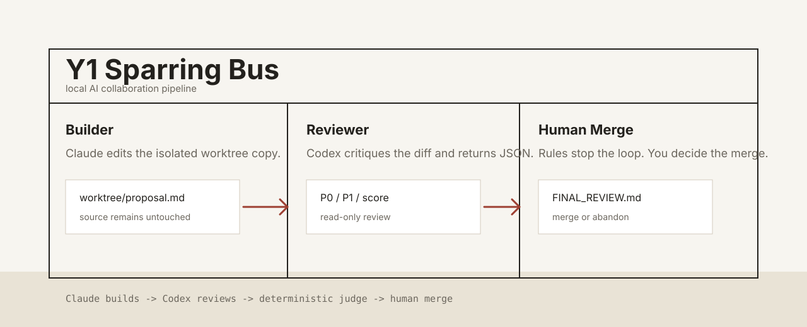

# Y1 Sparring Bus · 本机 AI 左右互搏总线

> **Claude 负责改，Codex 负责审，规则判断是否达标，最终由人决定是否合并。**
> *Claude writes. Codex reviews. Rules decide when it is good enough. You decide whether to merge.*

Y1 Sparring Bus 是一个跑在你自己电脑上的 AI 左右互搏控制台，适合打磨方案、汇报稿、策略备忘、提示词、Agent Skill 和小型代码文件。它把「让一个 AI 改、再让另一个 AI 挑刺」这件原本一团乱的事，变成可视化、可复盘、可人工把关的流程。



[](LICENSE)
[](#当前版本v10)
[](#系统要求)
[](#快速开始)
[](#为什么重要)

> **English**: Y1 Sparring Bus is a local-first AI sparring console. Claude rewrites an isolated copy of your file, Codex independently reviews and scores each round, a deterministic judge decides when to stop, and a human always makes the final merge decision. No API keys — it reuses your locally logged-in Claude Code and Codex CLIs.

## 下载后能直接用吗

可以直接跑的部分：本机页面、演示案例、文档、后端烟测。
完整自动互搏需要你的 Mac 已经安装并登录 Claude Code CLI 和 Codex CLI。

```bash
bash scripts/install.sh
bash scripts/smoke-test.sh
bash scripts/doctor.sh --strict
```

每个档位具体能用到什么程度，见 [docs/RUN_MODES.md](docs/RUN_MODES.md)。

## 它做什么

很多 AI 改稿流程都有同一个弱点：一个模型改得很自信，但你仍然不知道它到底是变好了，还是只是变顺了。

Y1 Sparring Bus 的做法是加上第二个模型，和一条明确的停止规则：

```text
你的文件 + 一句清晰的目标
  -> Claude Builder 在隔离副本上改稿
  -> 本地 Runner 检查明显风险
  -> Codex Reviewer 打分，按 P0/P1/P2 列问题
  -> 确定性 Judge 决定：继续 / 停止 / 上报给人
  -> 你看 FINAL_REVIEW + diff，决定合并还是放弃
```

最终拿到的不只是一个更好的稿子，还有一份完整留痕：改了什么、还剩什么风险、系统为什么判断可以停。改得好不好，第一次有了证据。

## 适合什么

| 使用场景 | 改善效果 |
|---|---|
| 领导汇报 | 结论前置、证据更清楚 |
| 商务方案 | 结构更稳、价值逻辑更强 |
| 策略备忘 | 假设和风险更明确 |
| Agent Skill / 提示词 | 触发边界更清楚 |
| 小型代码文件 | 合并前先做一道独立审查 |

## 演示案例

想最快理解它的作用，先跑演示案例。

| 案例 | 文件 | 建议目标 |
|---|---|---|
| 中文方案改稿 | [examples/demo_proposal_zh.md](examples/demo_proposal_zh.md) | `把这份方案改成适合领导评审的版本：结论前置，删掉防御性表达，补清楚投入产出逻辑，不编造数据。` |
| 英文管理备忘 | [examples/demo_leadership_memo_en.md](examples/demo_leadership_memo_en.md) | `Rewrite this into a crisp leadership memo: decision first, risks explicit, next actions concrete, no filler.` |
| Skill 边界收紧 | [examples/demo_agent_skill.md](examples/demo_agent_skill.md) | `Improve this skill spec: clarify triggers, non-goals, safety boundaries, and failure handling. Keep it practical.` |
| Python 代码审查 | [examples/demo_python_script.py](examples/demo_python_script.py) | `Review and improve this small script without changing its basic purpose. Fix correctness, clarity, and edge cases.` |

完整案例说明：[docs/DEMO_CASES.md](docs/DEMO_CASES.md)

## 为什么重要

整个产品只围绕一条原则设计：**AI 可以多轮迭代，但最终决策权必须在人手里。**

- 原文件永远不会被 AI 直接覆盖。
- 每个任务都会冻结原文快照，并复制一份隔离副本给 AI 修改。
- Builder prompt、diff、检查日志、Reviewer JSON、Judge 判断全部留存。
- 合并必须人工确认。
- Claude 子进程会移除 `ANTHROPIC_*` 环境变量，不走 API key 计费，只用你本机已登录的订阅。
- 任务就是本机的普通文件夹，没有数据库、守护服务或云端服务。

## 跑完会得到什么

```text
jobs/<job_id>/
  TASK.md                 # 固化的目标和验收门槛
  STATUS.json             # 当前状态和评分轨迹
  ledger.jsonl            # 追加式事件日志
  INPUT_SNAPSHOT/<file>   # 原文快照
  worktree/<file>         # AI 修改的隔离副本
  rounds/                 # 每轮的 prompt、diff、审查、判定记录
  FINAL.md                # 最终候选稿
  FINAL.diff              # 原文与最终稿的差异
  FINAL_REVIEW.md         # 给人看的决策简报
```

最有用的是 `FINAL_REVIEW.md`：它会告诉你改了什么、分数到了哪里、还剩什么问题，以及系统建议合并、继续一轮，还是交给人判断。

## 快速开始

```bash
bash scripts/install.sh
bash scripts/start.sh
```

打开：

```text
http://127.0.0.1:8765/sparring
```

指定文件浏览的根目录：

```bash
bash scripts/start.sh 8765 ~/Documents
# 或
SPARRING_WORKSPACE_ROOT=~/Documents bash scripts/start.sh
```

检查完整自动模式是否就绪：

```bash
bash scripts/doctor.sh --strict
```

停止：

```bash
bash scripts/stop.sh
```

## 系统要求

| 项目 | 要求 |
|---|---|
| 操作系统 | macOS |
| Python | 3.9+ |
| Builder | 本机 Claude Code CLI 已登录 |
| Reviewer | 本机 Codex CLI 已登录 |
| 输入 | 单个 UTF-8 文本文件 |

Word、PDF、Excel 和二进制文件请先转成 `.md` 或 `.txt`。

## 本机后台

后台是绑定到 `127.0.0.1` 的本机 Python 服务。它不是云端后台，也不会把你的文件暴露到公网。

普通临时后台进程：

```bash
bash scripts/start.sh
bash scripts/status.sh
bash scripts/stop.sh
```

可选：macOS 登录后自动启动：

```bash
bash scripts/install-service.sh 8765 ~/Documents
bash scripts/uninstall-service.sh
```

详情：[docs/BACKGROUND_SERVICE.md](docs/BACKGROUND_SERVICE.md)

## 当前版本：v1.0

第一个公开版本故意保持小而清晰：

- 单文件互搏
- 本机网页控制台
- Claude 改稿 + Codex 审稿
- 确定性 Judge
- 人工合并门
- 零 Python 第三方依赖

它不打算成为云平台、多人协作系统或自动部署 Agent。

v2 正在按计划升级：更顺滑的安装引导、多 AI 引擎支持、大白话的「改了什么」明细、全新界面与浏览器适配。完整路线图见 [docs/V2_UPGRADE_PLAN.md](docs/V2_UPGRADE_PLAN.md)。

## 文档

| 需求 | 文件 |
|---|---|
| 第一次跑通 | [docs/QUICKSTART.md](docs/QUICKSTART.md) |
| 可用档位 | [docs/RUN_MODES.md](docs/RUN_MODES.md) |
| 演示案例 | [docs/DEMO_CASES.md](docs/DEMO_CASES.md) |
| 完整手册 | [docs/MANUAL.md](docs/MANUAL.md) |
| 本机后台 | [docs/BACKGROUND_SERVICE.md](docs/BACKGROUND_SERVICE.md) |
| v2 升级计划 | [docs/V2_UPGRADE_PLAN.md](docs/V2_UPGRADE_PLAN.md) |
| 发布检查 | [docs/RELEASE_CHECKLIST.md](docs/RELEASE_CHECKLIST.md) |
| 架构说明 | [docs/ARCHITECTURE.md](docs/ARCHITECTURE.md) |
| 安装说明 | [INSTALL.md](INSTALL.md) |
| Skill 入口 | [SKILL.md](SKILL.md) |

## 设计参考

本项目参考了 [alchaincyf/darwin-skill](https://github.com/alchaincyf/darwin-skill) 这类开源 Agent Skill 项目的工程纪律：循环可见、评价标准明确、失败可处理、改动可保留也可回滚。

Y1 Sparring Bus 把这套思路用在了真实的文档与代码协作上。

## 许可证

MIT
